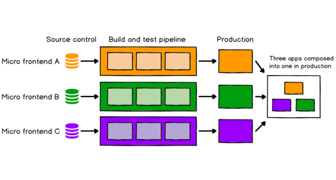

Micro frontend template

## What we are looking



## Dependencies
Execute this command and add this dependencies in your `pubspec.yaml` file:

```
flutter pub add dio logger print_map
flutter pub add --dev lint commitlint_cli 
dart pub add --dev husky
dart run husky install
dart run husky set .husky/commit-msg 'dart run commitlint_cli --edit "$1"'`
```

### Errors

Husky settings in case of errors

```
dart pub add --dev husky
dart run husky install
dart run husky set .husky/commit-msg 'dart run commitlint_cli --edit "$1"'``
```